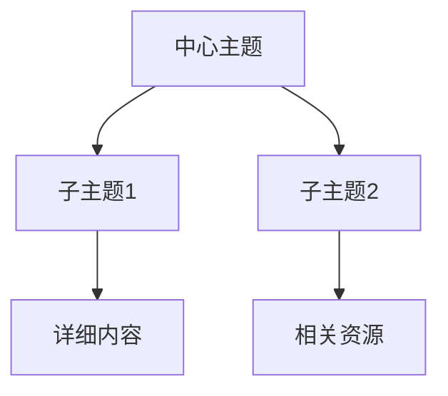

# Obsidian Canvas Reader

反向解读 Obsidian Canvas 白板文件，提取用户意图、项目信息、知识结构和可执行建议。

## 核心能力

| 能力 | 说明 |
|------|------|
| 项目管理提取 | 从白板提取任务、进度、依赖关系 |
| 知识结构理解 | 解析思维导图/知识结构，理解思考脉络 |
| 自动化执行建议 | 识别可执行的指令，返回执行建议 |
| 智能对话辅助 | 提供结构化上下文，辅助AI理解用户意图 |

## Canvas 文件结构速查

Canvas 文件是 JSON 格式，包含：
```json
{
  "nodes": [
    {"type": "text", "text": "内容", "color": "1", ...},
    {"type": "file", "file": "路径", ...},
    {"type": "link", "url": "URL", ...},
    {"type": "group", "label": "分组名", ...}
  ],
  "edges": [
    {"fromNode": "id1", "toNode": "id2", "label": "关系", ...}
  ]
}
```

## 解析方法

### Step 1: 读取 Canvas 文件

```bash
# 方法1: 使用 obsidian CLI
obsidian vault="<your vault name>" read file="CanvasName"

# 方法2: 直接读取文件
# 路径: ~/Documents/<your vault>/CanvasName.canvas
```

### Step 2: 解析节点结构

按类型分类节点：

| 节点类型 | 提取信息 | 意图推断 |
|----------|----------|----------|
| `group` | label, color, 坐标范围 | 主题分类、阶段划分 |
| `text` | text内容, color | 任务、想法、笔记 |
| `file` | file路径, subpath | 参考资料、关联文档 |
| `link` | url | 外部资源引用 |

### Step 3: 解析连接关系

从 edges 提取：
- `fromNode` → `toNode`: 节点间关系
- `label`: 关系描述（如"导致"、"包含"、"参考"）
- `color`: 关系重要性

### Step 4: 构建层次结构

通过坐标和group嵌套确定层次：
1. 识别所有 group 节点
2. 判断其他节点落在哪个 group 范围内
3. 构建 树形结构

## 意图识别规则

### 颜色语义映射

| 预设值 | 推断含义 |
|--------|----------|
| `"1"` (红) | 重要/紧急/警告 |
| `"2"` (橙) | 待办/进行中 |
| `"3"` (黄) | 思考/决策点 |
| `"4"` (绿) | 完成/成功/总结 |
| `"5"` (青) | 信息/资源 |
| `"6"` (紫) | 创意/灵感 |

### 任务检测模式

文本节点中检测：
```
- [ ]未完成任务
- [x] 已完成任务
# TODO / FIXME / BUG
## 阶段 / 期 / Phase
```

### 知识结构检测

- **中心节点**: 位置居中或被多个节点指向
- **核心概念**: 标题格式（# 开头）
- **关联关系**: edge 的 label 值

### 自动化意图检测

检测可执行指令模式：
```
创建: "创建笔记", "新建", "添加"
生成: "生成代码", "自动生成"
执行: "运行", "执行", "部署"
```

## 输出格式

### 1. 结构化JSON

```json
{
  "summary": {
    "title": "白板主题",
    "nodeCount": 10,
    "edgeCount": 5,
    "groups": ["阶段1", "阶段2"]
  },
  "structure": {
    "hierarchy": [...],
    "connections": [...]
  },
  "tasks": [
    {"text": "任务内容", "status": "todo", "priority": "high", "group": "阶段1"}
  ],
  "knowledge": {
    "topics": [...],
    "relations": [...],
    "resources": [...]
  },
  "intent": {
    "primaryGoal": "用户主要目标",
    "focusAreas": ["关注点1", "关注点2"],
    "actions": [
      {"type": "create", "target": "笔记名", "suggestion": "建议内容"}
    ]
  }
}
```

### 2. 任务清单格式

```markdown
# 项目名 - 任务清单

##高优先级
- [ ] 重要任务1 (红色标记)
- [ ] 重要任务2

##进行中
- [ ] 正在处理的任务 (橙色标记)

##待规划
- [ ] 其他任务

##已完成
- [x] 完成的任务
```

### 3. 知识图谱格式



### 4. 意图报告格式

```markdown
# 白板意图分析报告

## 核心目标
用户正在规划...

## 当前状态
- 进度: X%
- 主要关注: ...

## 发现的任务
1. ...
2. ...

## 建议的下一步
- [建议1]
- [建议2]

## 关联资源
- [[相关笔记1]]
- [[相关笔记2]]
```

## 使用示例

### 示例1: 提取任务列表

**用户**: "分析我的学习路径白板，提取所有任务"

**处理流程**:
1. 读取 `JavaScript学习路径.canvas`
2. 解析所有 text 节点
3. 检测任务模式（列表项、TODO标记）
4. 按颜色/分组分类优先级
5. 输出任务清单

### 示例2: 理解项目规划

**用户**: "这个白板是关于什么的？"

**处理流程**:
1. 解析 group 标签识别主题
2. 分析中心节点内容
3. 检测 edge 关系理解流程
4. 生成意图报告

### 示例3: 自动化建议

**用户**: "根据白板内容，帮我创建相关笔记"

**处理流程**:
1. 解析所有 text 节点内容
2. 识别可作为笔记的主题
3. 检测未创建的file引用
4. 返回创建建议列表

## 与其他 Skills 协作

| Skill | 协作场景 |
|-------|----------|
| `obsidian-cli` | 读取canvas文件 |
| `json-canvas` | 创建/编辑canvas |
| `obsidian-markdown` | 格式化输出内容 |
| `obsidian-vault-writer` | 基于解析结果创建笔记 |

##最佳实践

1. **先读取再分析**: 使用 `obsidian read` 或直接读取文件
2. **颜色推断需确认**: 颜色含义可能因人而异，必要时询问
3. **边缘情况处理**: 空白板、无连接节点、孤立分组
4. **输出格式适配**: 根据用户需求选择合适的输出格式
